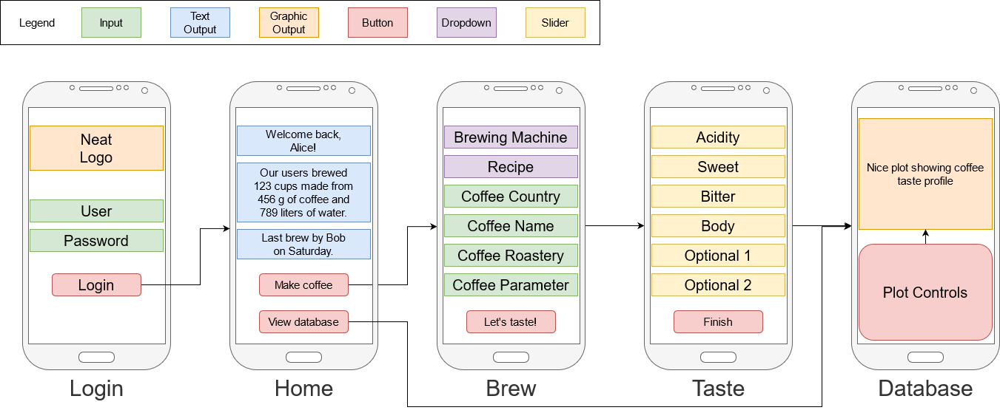

# pycoffee

Python based web app for coffee tasting with taste profile visualization and comparison.

## App Layout

## TODO

- GUI - Aestas  
- Pandas database - Talon  
- Taste wheel - Zorin
- Testing - Cruduk

- [ ] New user button - add username and pw hash to database, create tasting database
- [ ] Home screen show info about brewing from all databases
- [ ] Add window with last 5 entries buttons as autofill for bean info + new bean button
- [ ] Most used brewing methods (aeropress, v60, espresso, moka) as (radio) buttons + other as selection list/dropdown
- [ ] Brewing methods adaptive ordering based on recent entries (dynamic default value) + search database
- [ ] Back button
- [ ] Database taste wheel/visualization
- [ ] Discord user autenthication

## Database Structure

- **Entry Info**
  - **Date**
  - **User**
- **Bean Info**
  - **Country** - Kenya, Brazil, Ethiopia, Blend,...
  - **Name** - Kiwami, Diamond, Selva Negra, Valentina,...
  - **Roaster** - Motmot, Father's, Laura Coffee,...
  - **Processing** - natural, washed, honey, carbon,...
  - **Roast Level** - light to dark (1-5)
  - **Type** - Arabica/Robusta ratio
  - **Variety** - Heirloom, Tabi, Bourbon, Caturra,...
  - **Brewing Method** - espresso, V60, Aeropress, moka, frenchpress, phin,...
  - **Brewing Recipe** - inverted aeropress, ristretto, 40:60 dripper,...
- **Tasting**
  - **Rating (Hodnocení)** - bad to excellent (1-10)
  - **Sour (Kyselá)** - low to high (1-10)
  - **Sweet (Sladká)**
  - **Salty (Slaná)**
  - **Bitter (Hořká)**
  - **Note (Poznámka)** - optional text input

## Future ToDo ideas
  - [ ] Optional interactive guide after brewing method selection
  - [ ] Circle taste-graph
  - [ ] 2 and more brewed samples compare graph
  - [ ] Web interface to use on mobile phone

## Resources

- Tasting
  - [Proč a jak degustovat kávu?](https://coffeetohome.cz/proc-a-jak-degustovat-kavu)
- GUI
  - [PySimpleGUI Demos](https://github.com/PySimpleGUI/PySimpleGUI/tree/master/DemoPrograms)
  - [PySimpleGUI Playlist](https://youtube.com/playlist?list=PLl8dD0doyrvF1nLakJJ7sl8OX2YSHclqn)
  - [Colors](https://www.wikipython.com/tkinter-ttk-tix/summary-information/colors/)
  - [Themes](https://media.geeksforgeeks.org/wp-content/uploads/20200511200254/f19.jpg)
- [Pandas Basics Video](https://youtu.be/vmEHCJofslg)
- [Matplotlib Basics Video](https://www.youtube.com/watch?v=DAQNHzOcO5A)
- [Pandas Visualization](https://pandas.pydata.org/pandas-docs/stable/user_guide/visualization.html)
- [Progressive Web App Basics](https://www.youtube.com/watch?v=sFsRylCQblw)
- [PWA in Flask](https://stackoverflow.com/questions/46381128/building-progressive-web-apps-using-python-flask)
